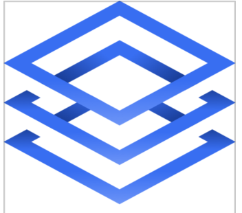
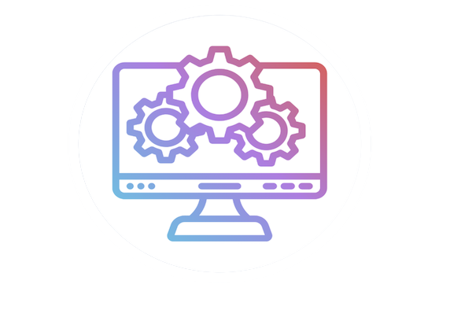

# QUILAB Quantum Informatics Laboratory @ University of Verona

## About us

QUILAB is the quantum computing laboratory at the University of Verona, dedicated to pushing the boundaries of quantum computing 
from both theoretical and applicative perspectives. 
Our research focuses on several topics including quantum machine learning, 
quantum languages, and quantum software development.

1. [Publications](#publications)
2. [Members](#members)
3. [Announcements](#announcements)
4. [Contact](#contact)

|                           |                       |  |  |
|------------------------------------------------|------------------------------------------------| --- | --- |
| [Quantum Languages & Semantics](#anchor_qlang) | [Quantum Software Development](#anchor_qlogic) | [Quantum Machine Learning & Applications](#anchor_qml) | [Quantum optimization & Applications]() |
|                           |                                 |  |  
|------------------------------------------------|------------------------------------------------| --- | 
| [Quantum Languages & Semantics](#anchor_qlang) | [Quantum Software Development](#anchor_qlogic) | [Quantum Machine Learning & Applications](#anchor_qml) | 

## Publications  
  
### 2024
1. Hoffmann M., ..., Di Pierro, A., Baumbach, J., List, M., Blumenthal, DB. Network medicine-based epistasis detection in complex diseases: ready for quantum computing (2023). Available at [https://www.medrxiv.org/content/10.1101/2023.11.07.23298205v1](https://www.medrxiv.org/content/10.1101/2023.11.07.23298205v1)
2. Incudini M., Lizzio Bosco, D., Martini, M., Grossi, M., Serra, G., Di Pierro, A. Automatic and effective discovery of quantum kernels (2023)
Available at [https://arxiv.org/abs/2209.11144](https://arxiv.org/abs/2209.11144)

### 2023
1. Di Marcantonio, F., Incudini, M., Tezza, D., & Grossi, M. (2023). Quantum Advantage Seeker with Kernels (QuASK): a software framework to speed up the research in quantum machine learning. Quantum Machine Intelligence, 5(20).
2. Incudini, M., Grossi, M., Ceschini, A., Mandarino, A., Panella, M., Vallecorsa, S., & Windridge, D. (2023). Resource saving via ensemble techniques for quantum neural networks. arXiv preprint arXiv:2303.11283.

### 2022
1. Incudini, M., Grossi, M., Mandarino, A., Vallecorsa, S., Di Pierro, A., & Windridge, D. (2022). The Quantum Path Kernel: a Generalized Quantum Neural Tangent Kernel for Deep Quantum Machine Learning. arXiv preprint arXiv:2212.11826.
2. Incudini, M., Martini, F., & Di Pierro, A. (2022). Structure Learning of Quantum Embeddings. arXiv preprint arXiv:2209.11144.
3. Incudini, M., Tarocco, F., Mengoni, R., Di Pierro, A., & Mandarino, A. (2022). Computing graph edit distance on quantum devices. Quantum Machine Intelligence, 4(2), 1-21.

### 2021
1. Di Pierro, A., & Incudini, M. (2021). Quantum Machine Learning and Fraud Detection. In Protocols, Strands, and Logic (pp. 139-155). Springer, Cham.
2. Mengoni, R., Incudini, M., & Di Pierro, A. (2021). Facial expression recognition on a quantum computer. Quantum Machine Intelligence, 3(1), 1-11.
 
### 2020
1. Mengoni, R., Di Pierro, A., Memarzadeh, L., & Mancini, S. (2020). Persistent homology analysis of multiqubit entanglement. Quantum Information and Computation, 20(5&6), 375-399.
2. S. Guerrini, S. Martini, A. Masini: Quantum Turing Machines: Computations and Measurements, Appl. Sci. 2020, 10(16), 5551; https://doi.org/10.3390/app10165551

### 2019
1. Mengoni, R., & Di Pierro, A. (2019). Kernel methods in quantum machine learning. Quantum Machine Intelligence, 1(3), 65-71.
2. Masini, A., & Zorzi, M. (2019). A logic for quantum register measurements. Axioms 8.1.
3. Zorzi, M. (2019). Quantum Calculi—From Theory to Language Design. Applied Sciences 9.24.
4. Paolini, L., Piccolo M., & Zorzi M. (2019). QPCF: higher-order languages and quantum circuits. Journal of Automated Reasoning 63.

### 2018
1. Windridge, D., Mengoni, R., & Nagarajan, R. (2018). Quantum error-correcting output codes. International Journal of Quantum Information, 16(08), 1840003.
2. Di Pierro, A., Mancini, S., Memarzadeh, L., & Mengoni, R. (2018). Homological analysis of multi-qubit entanglement. EPL (Europhysics Letters), 123(3), 30006.
3. Bottarelli, L., Bicego, M., Denitto, M., Di Pierro, A., Farinelli, A., & Mengoni, R. (2018). Biclustering with a quantum annealer. Soft Computing, 22(18), 6247-6260.

### 2017
1. Pierro, A. D., Mengoni, R., Nagarajan, R., & Windridge, D. (2017, December). Hamming Distance Kernelisation via Topological Quantum Computation. In International Conference on Theory and Practice of Natural Computing (pp. 269-280). Springer, Cham.

## Members   

### Internal members 

- Alessandra Di Pierro (alessandra.dipierro@univr.it)
- Massimiliano Incudini
- Nicola Assolini
- Francesco Martini
- Andrea Masini
- Margherita Zorzi

### External members

- Michele Grossi
- Antonio Mandarino
- David Windridge
- Minh Ha Quang
- Davide Pastorello
- Giuseppe Serra

### Former members

- Riccardo Mengoni

## Announcements

### Quilab Workshop - 7th June 2023 
Department of Computer Science 
Strada le Grazie 15
37134 Verona

## Contact  

### How to reach us

QUILAB is hosted at the University of Verona, Department of Computer Science:

> Università degli Studi di Verona - Dip. Informatica - Ca’ Vignal 2 \
> Strada le Grazie, 15 \
> 37134, Verona (VR) \
> Italy

### About this website

This website is hosted on Github Pages.
